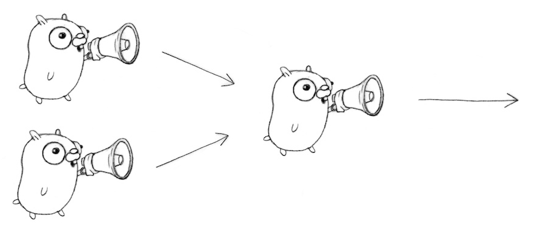

# Go 동시성 프로그래밍

## Goroutine and Channels

> GoRoutine

    - 고루틴은 동일한 주소영역내에서 독립적으로 실행되는 함수이다.
    - go 문에 의해 실행되어 독립적으로 실행하는 함수
    - 스레드는 아님

> Channel

    - GoRoutine간의 데이터 pipeline 역할을 한다.
    - c <- value 실행하면 값이 전송될때까지 기다린다 => 채널은 통신하고 동기화 한다.

```go
func main() {

	c := make(chan string)
	go boring("hello world", c)

	consumer(c)
}

func consumer(c chan string) {
	fmt.Println("hladsf")
	for data := range c {
		fmt.Println(data)
	}
}

func boring(msg string, ch chan string) chan string {

	defer close(ch)
	for i := 0; i <10; i++ {
		ch <- fmt.Sprintf("%s >> %d", msg, i )
	}

	return ch
}
```

## Basic Pattern

> Generator

- Channel은 일급객체
- Channel 자체를 Return 하여 사용한다

```go
package main

import (
	"fmt"
)

func main() {
	joe := boring()
	ann := boring()

	for i:=0; i<10; i++ {
		fmt.Println(<-joe)
		fmt.Println(<-ann)
	}
}

func boring() chan int {
	ch := make(chan int)

	go func() {
		defer close(ch)

		for i := 0; i< 10; i++ {
			ch <- i
		}
	}()


	return ch // Return the channel to the caller
}
```

> Multiplexing



- 두개의 고루틴을 사용하되, Fan-in 기능을 사용한다
- Fan-in 기능을 사용하여 준비된 사람이 누구든지 대화할수 있도록 한다

```go
package main

import (
	"time"
	"fmt"
)

func main() {
	start := time.Now()

	joe := boring("joe")
	ann := boring("ann")

	c := fanIn(joe, ann)
	defer close(c)

	fmt.Println("end >> ", time.Since(start), len(c))


}

func boring(str string) chan string{
	ch := make(chan string)

	go func() {
		defer close(ch)

		for i:=0; i< 1000000000000;i ++ {
			ch <- fmt.Sprintf("%s => %d", str, i)
		}
	}()

	return ch
}

func fanInAlone(input1 chan string) chan string {
	c := make(chan string)

	go func() { for {c <- <-input1}}() // input1이 소진될때까지 부여
	return c
}

func fanIn(input1, input2 chan string) chan string{
	c := make(chan string)

	go func() { for {c <- <-input1}}() // input1이 소진될때까지 부여
	go func() { for {c <- <-input2}}() // input2이 소진될때까지 부여
	return c
}
```

## Select Pattern (쥰내어렵네..)

- 동시성에 고유한 제어구조
- Select를 사용하여 동시성을 제어한다.
- Select 절을 사용하여 순차적으로 진행 & 병렬처리를 가능케 한다.
- Switch문과 비슷하지만 case에 채널이 사용된다.
- Case는 보통 순차적으로 실행되지는 않는다 다만, 한 Case가 끝날때까지 기다린다.

> Basic Select

- Select문에 있는 채널들은 위의 결과를 기다린다.
- case 문에 채널의 값이 들어올때까지 select문에서 블록됨
- Default가 존재한다면 블록되지 않음

```go
func main() {
	c1,c2 := make(chan string), make(chan string)
	defer close(c1)
	defer close(c2)

	go func() {
		for {
			time.Sleep(5 * time.Second)
			c1 <- "one"
		}
	}()

	go func() {
		for {
			time.Sleep(5 * time.Second)
			c2 <- "two"
		}
	}()

	// 값을 기다림...
	for {
		fmt.Println("start select --------------")
		select {
		case msg1 := <-c1:
			fmt.Println("reciver : ", msg1)
		case msg2 := <-c2:
			fmt.Println("reciver : ", msg2)
		// default:
		// 		fmt.Println("default")
		}
	}

	fmt.Println("end select ------------------")
}
```

## Ping-pong
