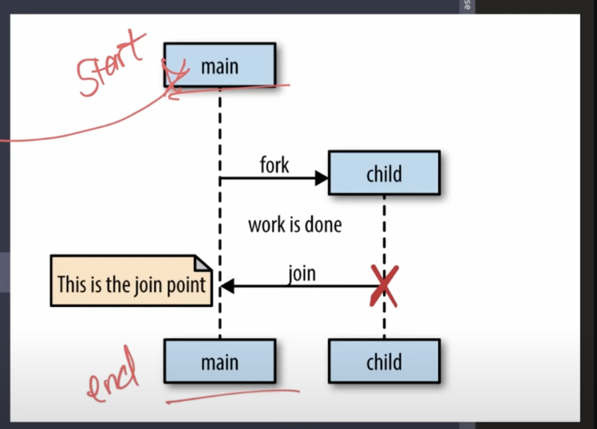

# GoRoutine



```go
    go someFunc(1)
	go someFunc(2)
	go someFunc(3)

	fmt.Println("hello world")
```

- main함수자체가 끝나면 그때 fork가 발생한다
- fork 부분에서 비동기작업을 실행한다
- 위 코드의 경우 main { } 함수 이후 child fork가 3개 발생한 후 동작한다.
- 동작을 한 후 Join 한다 -> (This is the join port) -> Join Point에서 만나게 해야 한다.
